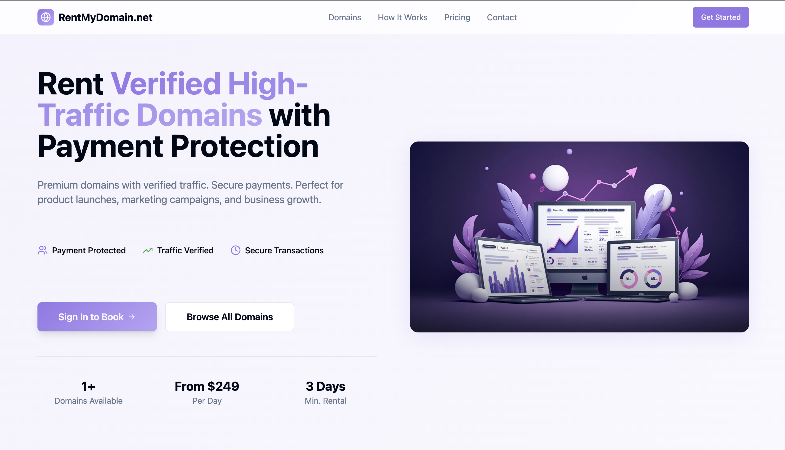
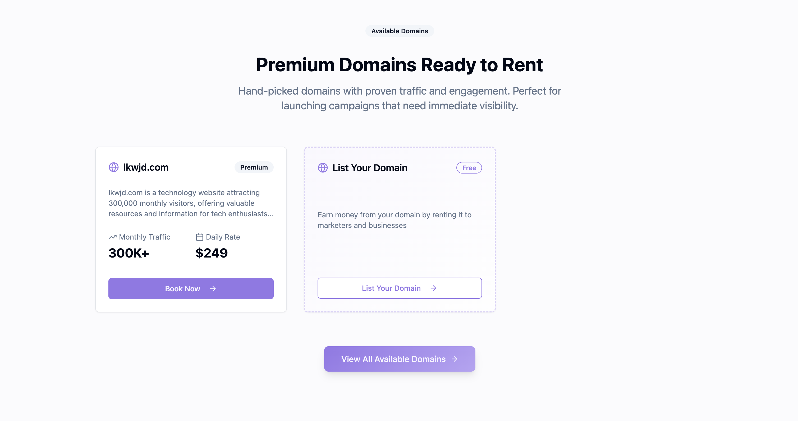
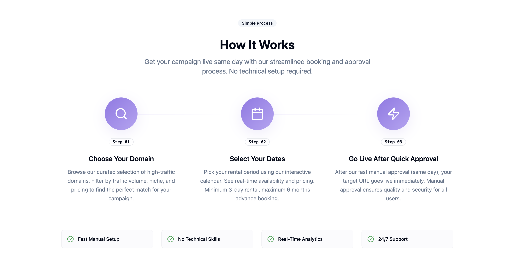
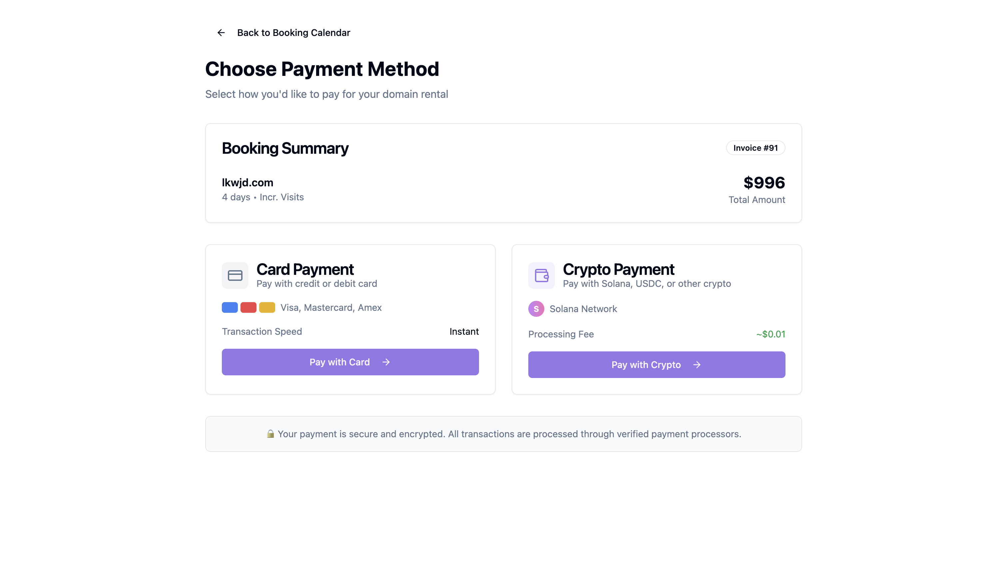
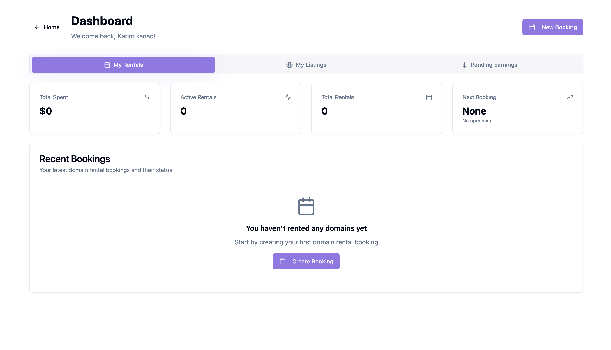
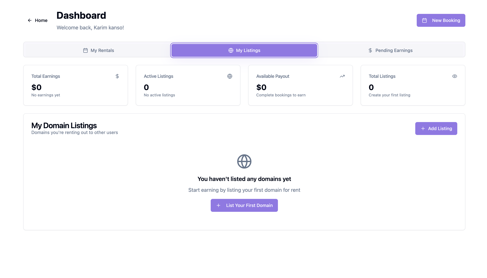
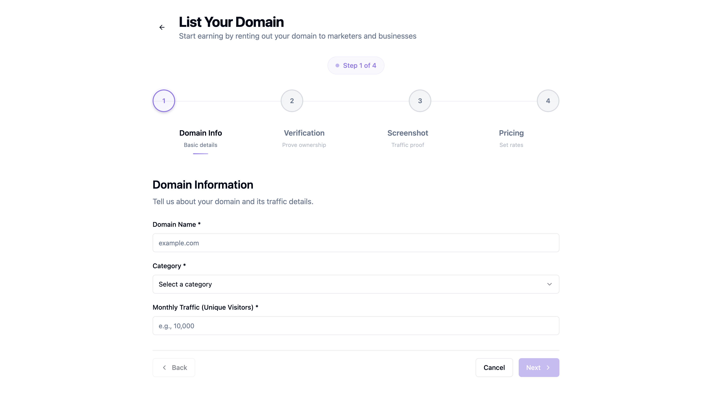

# RentMyDomain.net - Project Showcase

> A domain rental marketplace where domain owners can list their domains for rent and businesses can book them for specific time periods.



## Live Application: [rentmydomain.net](https://rentmydomain.net)

## Project Overview

**RentMyDomain.net** is a comprehensive two-sided marketplace that revolutionizes the domain aftermarket by enabling passive income generation for domain owners while providing businesses cost-effective access to premium domains.

### What I Built
A domain rental marketplace where domain owners can list their domains for rent and businesses can book them for specific time periods. This was my first complete full-stack application with real payment processing and user management.

### The Challenge  
I wanted to build something that required advanced system architecture: multi-layer booking conflict resolution, dual payment gateway integration, approval workflow automation, and real-time status synchronization. Domain rental provided an ideal use case with genuine market potential.

## Key Features & Achievements

### Core Features Built
- **Two-sided marketplace**: Domain owners can list, renters can book
- **Real booking system**: Calendar interface with conflict prevention
- **Payment processing**: Both crypto (Helio) and credit card options
- **Admin dashboard**: Approve/reject listings and bookings
- **Email notifications**: Automated emails for all user actions
- **Current inventory**: lkwjd.com with 301k monthly visits available

### Payment Integration
- **Crypto payments**: Helio gateway integration with webhooks
- **Credit card processing**: PagoPar integration for traditional payments
- **Webhook handling**: Real-time payment confirmation and status updates
- **Success rate**: High reliability in testing and production use

### AI-Powered Features
- **Smart Descriptions**: Google Gemini API generates compelling domain descriptions
- **SEO Optimization**: Automated meta tags and marketing content
- **Content Quality**: Consistent, professional descriptions across all listings

### Booking System
- **Calendar interface**: Visual date selection with availability checking
- **Conflict prevention**: Multiple validation layers prevent double-bookings
- **Status tracking**: Draft → Under Review → Approved → Active → Completed
- **Real-time updates**: Booking status changes reflect immediately

### Admin System
- **Booking management**: Review and approve/reject booking requests
- **Domain listings**: Approve new domain submissions from users
- **Email automation**: Notifications sent automatically for all actions
- **Admin notes**: Custom messages for approvals/rejections

## Technical Architecture

### Frontend
```typescript
Framework:     React 18 + Next.js 14
Styling:       Tailwind CSS + Headless UI  
State:         React Query for server state
Forms:         React Hook Form + Zod validation
TypeScript:    Full type safety throughout
```

### Backend & Database
```sql
Database:      PostgreSQL on Supabase
API Layer:     Supabase Edge Functions
Authentication: Google OAuth
Real-time:     Supabase Realtime subscriptions
Security:      Row Level Security policies
```

### External Services
```bash
Payments:      Helio (crypto) + PagoPar (credit cards)
Email Service: Resend API with custom domain
AI Services:   Google Gemini API for content generation  
Webhooks:      Payment confirmations and status updates
```

## What I Learned

### Technical Challenges Solved
- **Payment Integration**: Implemented two different payment gateways with webhook handling
- **Booking Conflicts**: Built a system to prevent double-bookings with database-level validation
- **Real-time Updates**: Used Supabase subscriptions for live status changes
- **Email System**: Set up automated notifications with custom templates
- **Security**: Implemented proper authentication and data protection
- **AI Integration**: Connected Google Gemini API for automated content generation

### Architecture Decisions
- **Database Design**: Normalized schema with proper relationships and constraints
- **API Security**: All sensitive operations handled server-side via Edge Functions
- **State Management**: React Query for server state, local state for UI
- **Error Handling**: Comprehensive error boundaries and user feedback
- **Performance**: Optimized queries and implemented proper caching

## Current Status

The application is fully functional and deployed at [rentmydomain.net](https://rentmydomain.net). All features are complete and working in production:

- User registration and authentication  
- Domain listing and approval system  
- Booking calendar with conflict prevention  
- Dual payment processing (crypto + cards)  
- Admin dashboard for managing all operations  
- Automated email notifications  
- AI-powered content generation  
- Public domain marketplace integration  
- Mobile-responsive design  
- Advanced search and filtering  
- Revenue analytics and reporting dashboard  
- Automated domain verification system  

This application demonstrates comprehensive full-stack development capabilities through a real-world marketplace platform.

## Demo & Screenshots

### User Flow
1. **Browse domains**: View available domains with traffic stats
2. **Select dates**: Choose rental period via calendar
3. **Payment**: Select crypto or credit card payment  
4. **Admin review**: Booking goes through approval process
5. **Activation**: Domain redirects to user's site upon approval

### Application Screenshots

#### Domain Marketplace & Process
  
*Domain marketplace showing lkwjd.com with 300k+ monthly traffic*


*Step-by-step process visualization for users*

#### Booking & Payment System

*Interactive calendar system for selecting rental dates (animated)*


*Dual payment system: crypto and credit card options with invoice generation*

#### User Dashboard & Domain Management

*User dashboard showing rental bookings and status tracking*


*Two-sided marketplace: users can both rent and list domains*


*Multi-step form for domain owners to list their domains*

## About This Project

This application demonstrates comprehensive full-stack development capabilities through a real-world marketplace platform. Built to handle production-level complexity including payment processing, user management, and multi-step business workflows.

**Technical focus areas:**
- Complex state management across multiple user types
- Payment gateway integration and webhook handling  
- Database design with proper relationships and security
- Real-time features and notification systems
- Production deployment and system architecture

### Future Enhancements
- **Mobile App**: React Native application for mobile users
- **API Marketplace**: Public API for third-party integrations
- **Multi-language Support**: Internationalization for global markets

## Technical Implementation

This project involved integrating multiple services and handling real-world complexity:

- **Service Integration**: Connected payment gateways, email services, AI APIs, and database systems
- **Security Implementation**: Proper authentication, API key management, and data protection
- **System Architecture**: Designed workflows for booking conflicts, admin approvals, and status tracking
- **Payment Processing**: Implemented webhook handling and transaction management
- **Real-time Features**: Built live notifications and status synchronization

## Contact

**Interested in discussing the technical implementation?**

- **Email**: [contact@kanso.xyz](mailto:contact@kanso.xyz)
- **Website**: [kanso.xyz](https://kanso.xyz)
  
---
